# Lightgun Arcade - Modular Game Framework
## Master Planning Document

---

## 1. Executive Summary

### Vision
Transform the current Lightgun Arcade into a flexible, extensible platform where developers can create and publish lightgun games that seamlessly integrate with a unified arcade system. The platform will support multiple guns, user accounts, social features, tournaments, and both local and online multiplayer.

### Core Objectives
- **Plug-and-Play Games**: Games integrate automatically with standardized interfaces
- **Multi-Gun Support**: Full support for multiple lightgun devices with per-player configuration
- **Social Platform**: User accounts, friends, activity feeds, and tournaments
- **Community Driven**: Asset library and game creation tools for community contributions
- **AI-Powered Creation**: Long-term goal of AI-assisted game development
- **Multiplayer Ready**: Local multiplayer immediately, online multiplayer architecture planned from the start

### Target Users
1. **Players**: Enjoy arcade-style lightgun games with friends and compete in tournaments
2. **Game Developers**: Create and publish lightgun games using the SDK
3. **Content Creators**: Contribute assets (sprites, backgrounds, sounds) to the library
4. **Tournament Organizers**: Create and manage competitive events
5. **AI Users**: Non-technical users who create games through AI assistance

---

## 2. Feature Breakdown by Priority

### **Phase 1: Multi-Gun Foundation** 🔴 *CRITICAL*

#### Gun Configuration System
- [x] **Device Detection & Assignment**
  - Device enumeration using browser APIs (Pointer Events, HID API)
  - "Detect Player 1/2/3/4" button workflow
  - User presses button on gun to associate device with player
  - Device fingerprinting for reconnection
  - Save gun-to-player mappings (persistent)

- [x] **Button Mapping**
  - Map trigger button
  - Map start/pause button
  - Map action button (secondary)
  - Visual feedback during mapping
  - Test mode to verify mappings

- [x] **Reload Configuration**
  - Test on-screen shooting detection
  - Test off-screen shooting detection
  - Compare trigger signals (on vs off screen)
  - Validation: Warn if signals are identical
  - Per-gun reload capability saved
  - Fallback modes if reload not supported

- [x] **Gun Calibration**
  - Per-gun calibration routine
  - Save calibration data per device
  - Recalibration option in settings
  - Test accuracy tool

- [x] **Multi-Gun Input Routing**
  - Route input events to correct player
  - Handle simultaneous inputs from multiple guns
  - Input buffering/smoothing
  - Latency optimization (< 16ms target)

#### Global Gun Management
- Persistent gun profiles (device ID → player assignment)
- Gun disconnection/reconnection handling
- Settings panel for gun management
- Visual indicator of which guns are active

---

### **Phase 2: Backend Infrastructure** 🔴 *HIGH PRIORITY*

#### Supabase Integration
- [x] **Database Setup**
  - PostgreSQL database via Supabase
  - Row-level security (RLS) policies
  - Real-time subscriptions for live data
  - Edge functions for serverless logic

- [x] **Authentication**
  - Email/password authentication
  - OAuth providers (Google, Discord, GitHub)
  - Guest accounts (local profiles)
  - Account linking (guest → registered)
  - Session management
  - Remember me / auto-login

- [x] **User Profiles**
  - Username (unique, 3-20 chars)
  - Avatar (upload or select from library)
  - Bio/description
  - Privacy settings
  - Account creation date
  - Last active timestamp

#### Core Services
- [x] **AuthService**: User authentication and session management
- [x] **UserService**: Profile management and user data
- [x] **StorageService**: Asset uploads (avatars, custom content)
- [x] **RealtimeService**: WebSocket connections for live features

---

### **Phase 3: Social Features & Tournaments** 🟢 *IMPLEMENTED*

#### Friends System
- [x] **Friend Management**
  - Send friend requests
  - Accept/decline requests
  - Remove friends
  - Block/unblock users
  - Friend list view (online status)
  - View user profiles

- [x] **Friend Discovery**
  - Search by username
  - Suggested friends (mutual friends, recently played with)
  - QR code friend adding (for local arcade setups)

- [x] **Privacy Controls**
  - Who can send friend requests (everyone, friends-of-friends, none)
  - Profile visibility (public, friends-only, private)
  - Activity visibility settings

- [x] **Online Presence** (New - Dec 2025)
  - Real-time presence tracking via Supabase Realtime
  - Status types: online, away, busy, playing
  - Shows current game being played
  - Friends sorted by online status
  - Automatic updates on game launch/exit

- [x] **User Profile Viewing** (New - Dec 2025)
  - ProfileViewScreen for viewing other users
  - User stats display (games played, playtime)
  - Recent activity display
  - Friend actions (add/remove/block)
  - Online status and current game

- [x] **Real-Time Notifications** (New - Dec 2025)
  - Toast notifications for social events
  - Friend request notifications
  - Friend accepted notifications
  - Score beat notifications
  - NotificationService with Supabase Realtime

#### Activity Feed
- [x] **Feed Items**
  - High score posted
  - Personal best achieved (auto-posted)
  - Game played (with who, if multiplayer)
  - Achievement unlocked
  - Tournament joined/won
  - New game published
  - Friend added

- [x] **Feed Features**
  - Real-time updates
  - Reactions (like, trophy, fire emojis)
  - Comments on feed items
  - Filter by friend or game
  - Infinite scroll pagination
  - Auto-posting on personal bests (single & multiplayer)

#### Tournament System
- [x] **Tournament Types**
  - **Asynchronous**: Time-limited, flexible attempts
  - **Synchronous**: Scheduled live events

- [x] **Async Tournament Configuration**
  - Time window (duration: hours/days/weeks)
  - Attempt limits:
    - Unlimited attempts (best score wins)
    - Limited attempts (e.g., 3 tries)
    - Single attempt only
  - Score submission rules:
    - Best score
    - Average of all attempts
    - Cumulative score
  - Entry requirements (level, achievements, etc.)

- [x] **Sync Tournament Features**
  - Scheduled start time (countdown)
  - All players compete simultaneously
  - Real-time leaderboard updates during tournament
  - Bracket systems (single/double elimination)
  - Live spectator mode (Phase 6+)

- [x] **Tournament Management**
  - User roles: Player, Organizer, Moderator, Admin
  - Organizer+ can create tournaments
  - Tournament creation wizard:
    - Select game and mode
    - Configure rules
    - Set entry requirements
    - Optional prizes/rewards
    - Visibility (public/private/invite-only)
  - Tournament lobby (chat, participant list)
  - Results page with rankings and replays

- [x] **Tournament UI**
  - "TOURNAMENTS" button on main menu
  - Badge showing active tournament count
  - Tournament hub:
    - Upcoming (future scheduled)
    - Live/Active (currently running)
    - Past (historical with results)
    - My Tournaments (user's participation)
  - Filters: by game, type, status

#### User Activity Tracking
- [x] **Play History**
  - Session data: date, time, duration
  - Game played, mode, difficulty
  - Players involved (if multiplayer)
  - Scores achieved
  - Replay data (optional, for tournaments)

- [x] **Statistics Dashboard**
  - Games played (with frequency)
  - Total playtime per game
  - Last played timestamp
  - Score progression graphs (over time)
  - Accuracy trends
  - Most played games
  - Friends played with (frequency)

- [x] **Visualizations**
  - Score improvement line graphs
  - Play time heatmaps (by day/hour)
  - Achievement completion percentage
  - Leaderboard position history

#### Leaderboards
- [x] **Per-Game Leaderboards**
  - Global top scores per game
  - Filter by difficulty and mode
  - Time-based filters (all-time, monthly, weekly, daily)
  - Friends-only leaderboards
  - Pagination and search

- [x] **Tournament Leaderboards**
  - Separate boards for each tournament
  - Live updates during sync tournaments
  - Historical tournament results

- [x] **Personal Bests**
  - User's best score per game/mode/difficulty
  - Progress toward top scores
  - Percentile ranking

---

### **Phase 4: Local Multiplayer** 🟡 *MEDIUM PRIORITY*

#### Multiplayer Infrastructure
- [x] **Player Management**
  - Support 1-4 players
  - Each player assigned to a gun
  - Guest players (no account required)
  - Registered players (track stats)
  - Player selection screen before game

- [x] **Multiplayer Modes** (All Games Required)
  - **Simultaneous**: All players shoot at the same time
    - Co-op: Team objectives, shared score
    - Versus: Competitive, individual scores
  - **Turn-Based**: Players take turns
    - Hot-seat style
    - Round-robin turns

- [x] **Game Requirements**
  - Every game MUST support multiplayer
  - Games declare supported modes in manifest
  - Minimum 1 player, maximum defined per game
  - Default to 2-player support

#### Multiplayer UX
- [x] **Player Differentiation**
  - Color coding (P1 = blue, P2 = red, etc.)
  - Screen zones/sections per player
  - Individual HUD elements
  - Name tags or icons

- [x] **Shared State**
  - Score displays for all players
  - Turn indicators (for turn-based)
  - Team status (for co-op)
  - Simultaneous input handling

- [x] **Post-Game Results**
  - Individual player scores
  - Winner announcement
  - Statistics breakdown per player
  - Rematch option

---

### **Phase 5: Community Content Platform** 🟢 *LOWER PRIORITY*

#### Asset Library
- [x] **Stock Assets** (Seeded by Platform)
  - Backgrounds: 20+ themes (countryside, city, space, ocean, desert, etc.)
  - Targets: 50+ sprites (animals, objects, enemies, abstract)
  - Sounds: 100+ effects (gunshots, hits, explosions, UI sounds)
  - Music: 10+ background tracks
  - UI Elements: Buttons, icons, fonts, cursors

- [x] **Community Uploads**
  - Asset submission form
  - File type validation (PNG, JPG, SVG, WAV, MP3, OGG)
  - File size limits (images: 5MB, audio: 10MB)
  - Metadata: name, description, tags, license
  - Preview thumbnails

- [x] **Moderation System**
  - All uploads go to moderation queue
  - Admin/moderator approval required
  - Automated scanning:
    - Inappropriate content detection (AI/ML filters)
    - Malware scanning
    - Copyright detection (reverse image search)
  - Manual review by moderators
  - Rejection with reason

- [x] **Asset Discovery**
  - Browse by category (backgrounds, sprites, sounds, music)
  - Tag-based filtering
  - Search by name or description
  - Sort by: popularity, newest, highest rated
  - Usage statistics (number of games using asset)
  - Ratings and reviews

- [x] **Asset Management**
  - License tracking (CC0, CC-BY, proprietary, etc.)
  - Version control (update assets, keep old versions)
  - Deprecation warnings (if asset is outdated)
  - Asset packs (bundled related assets)

#### Game Submission
- [x] **Upload Process**
  - Package game as ZIP or tarball
  - Manifest validation (required fields)
  - Asset validation (all referenced assets exist)
  - Automated testing:
    - Game loads successfully
    - Implements required interfaces
    - Performance benchmarks pass
    - No errors during 1-minute test run
  - Manual review (for public listing)

- [x] **Game Listing**
  - Public vs unlisted vs private
  - Game page with screenshots, description
  - Play count tracking
  - Rating and reviews
  - Comments section
  - Update/versioning system

- [x] **Game Discovery**
  - Featured games carousel
  - Browse all games
  - Filter by tags, author, rating
  - Search functionality
  - Trending games (based on recent plays)

---

### **Phase 6: AI Game Creation** 🔵 *LONG-TERM GOAL*

#### Web-Based AI Builder
- [x] **Asset Selection Phase**
  - Browse stock and community asset library
  - Select backgrounds, targets, sounds, music
  - Preview selected assets
  - Add to game project

- [x] **Conversational Design Phase**
  - Chat interface with AI agent
  - User describes game concept ("I want aliens popping out of windows")
  - AI asks clarifying questions:
    - Game mechanics (shooting, timing, combos)
    - Difficulty progression
    - Scoring system
    - Round structure
    - Power-ups or special features
  - Iterative back-and-forth until design is complete
  - Summary of game design for user approval

- [x] **Generation Phase**
  - Design document passed to builder agent
  - Builder agent generates:
    - Game class code
    - Manifest file
    - Asset references
    - Configuration files
  - Code generation using templates and SDK
  - Automated testing

- [x] **Preview & Testing Phase**
  - User plays generated game
  - Feedback collection
  - Iteration: request changes, regenerate
  - Final approval

- [x] **Publishing Phase**
  - User submits to arcade
  - Automated validation
  - Optional manual review for public listing
  - Game goes live

#### Local Development SDK
- [x] **SDK Package**
  - CLI tool: `npx create-lightgun-game my-game`
  - Scaffolds basic game structure
  - Includes example game templates
  - Local dev server with hot reload

- [x] **Development Flow**
  - Developer codes locally with AI assistant (Claude, Cursor, GitHub Copilot)
  - Use SDK utilities and helper classes
  - Test in local environment
  - Package: `npx package-lightgun-game`
  - Creates upload bundle (ZIP with manifest)

- [x] **Upload & Deploy**
  - Upload bundle to arcade platform
  - Automated validation (same as web builder)
  - Optional manual review
  - Deployment to arcade

#### Hybrid Workflow
- Users can start with AI builder
- Download generated source code
- Refine locally with coding tools
- Re-upload updated version

---

### **Phase 7: Online Multiplayer** 🔵 *FUTURE*

> **Note**: Designed now to ensure compatibility, implemented later.

#### Real-Time Architecture
- [x] **WebSocket Infrastructure**
  - Persistent connections for all online players
  - Message routing and broadcasting
  - Connection management (reconnection, timeouts)
  - Latency optimization

- [x] **Game State Synchronization**
  - Server authoritative model (anti-cheat)
  - Client-side prediction for responsiveness
  - State reconciliation for divergence
  - Snapshot interpolation for smooth visuals

- [x] **Matchmaking**
  - Quick match (automatic pairing)
  - Private lobbies (invite friends)
  - Skill-based matchmaking (optional)
  - Region-based matching (reduce latency)

#### Game Modes
- [x] **Co-op**: Team objectives, work together remotely
- [x] **Versus**: Head-to-head competition
- [x] **Tournaments**: Online sync tournaments with spectators

#### Spectator Mode
- [x] **Live Viewing**
  - Watch friends or tournament players in real-time
  - Multiple camera angles (if game supports)
  - Spectator UI (scores, stats, player info)

- [x] **Replays**
  - Record gameplay sessions
  - Replay browser (watch past games)
  - Share replay links
  - Downloadable replay files

#### Online Multiplayer Considerations
- **Input Validation**: Server validates all shots to prevent cheating
- **Latency Compensation**: Handle network delays gracefully
- **Disconnection Handling**: Graceful degradation if player drops
- **Cross-Platform**: Works with any input method (mouse, Gun4IR, Sinden)

---

## 3. System Architecture

### High-Level Overview


### Component Breakdown

#### **Arcade System** (Core Orchestrator)
- Manages application lifecycle
- Routes between arcade menu, games, settings
- Coordinates services
- Game loop management

#### **Gun Manager**
- Device detection and enumeration
- Player-to-device assignment
- Button mapping configuration
- Reload capability detection
- Calibration management

#### **Input Router**
- Routes input events to active players
- Handles simultaneous multi-gun input
- Provides unified input API to games
- Latency optimization

#### **Game Registry**
- Auto-discovers games in `/games/` folder
- Validates game manifests
- Provides game metadata to arcade menu
- Handles game instantiation

#### **Service Layer**
- **AuthService**: Manages user authentication and sessions
- **UserService**: User profiles, stats, activity tracking
- **SocialService**: Friends, activity feed, leaderboards
- **TournamentService**: Tournament creation, management, scoring
- **AssetService**: Asset library, community uploads
- **StorageService**: File uploads to Supabase Storage

---

## 4. Gun Configuration System

### Device Detection Flow

```mermaid
sequenceDiagram
    participant User
    participant UI
    participant GunManager
    participant Browser
    
    User->>UI: Click "Detect Player 1"
    UI->>GunManager: startDetection(playerId: 1)
    GunManager->>UI: Show "Press button on gun..."
    User->>Browser: Presses trigger on Gun A
    Browser->>GunManager: pointerdown event (deviceId: "gun-a")
    GunManager->>GunManager: Associate deviceId "gun-a" → Player 1
    GunManager->>UI: Show "Gun A assigned to Player 1 ✓"
    GunManager->>GunManager: Save to localStorage
```



### Button Mapping Flow


### Reload Detection

```mermaid
graph LR
    A[Start Reload Test] --> B[Show on-screen target]
    B --> C[User shoots target]
    C --> D[Record trigger signal A]
    D --> E[Show "Point gun off-screen and shoot"]
    E --> F[User shoots off-screen]
    F --> G[Record trigger signal B]
    G --> H{Signals different?}
    H -->|Yes| I[Reload Supported ✓]
    H -->|No| J[Reload NOT Supported ⚠️]
    I --> K[Save capability: true]
    J --> L[Save capability: false]
    J --> M[Show warning to user]
```

### Gun Profile Storage

```javascript
// LocalStorage structure
{
  "guns": {
    "gun-a-device-id": {
      "name": "Sinden Lightgun #1",
      "assignedPlayer": 1,
      "buttons": {
        "trigger": { "button": 0 },
        "start": { "button": 1 },
        "action": { "button": 2 }
      },
      "reloadSupported": true,
      "calibration": {
        "offsetX": 0,
        "offsetY": 0,
        "scale": 1.0
      },
      "lastUsed": "2025-11-27T16:00:00Z"
    }
  },
  "defaultPlayer1Gun": "gun-a-device-id",
  "defaultPlayer2Gun": "gun-b-device-id"
}
```

---

## 5. Database Schema (Supabase Postgres)

### Users & Authentication

```sql
-- Users table (extends Supabase auth.users)
CREATE TABLE profiles (
  id UUID PRIMARY KEY REFERENCES auth.users(id) ON DELETE CASCADE,
  username VARCHAR(20) UNIQUE NOT NULL,
  display_name VARCHAR(50),
  avatar_url TEXT,
  bio TEXT,
  role VARCHAR(20) DEFAULT 'player', -- player, organizer, moderator, admin
  privacy_settings JSONB DEFAULT '{"profile": "public", "activity": "friends", "friend_requests": "everyone"}',
  created_at TIMESTAMPTZ DEFAULT NOW(),
  updated_at TIMESTAMPTZ DEFAULT NOW(),
  last_active TIMESTAMPTZ
);

-- Indexes
CREATE INDEX idx_profiles_username ON profiles(username);
CREATE INDEX idx_profiles_role ON profiles(role);
```

### Friends System

```sql
-- Friendships table
CREATE TABLE friendships (
  id UUID PRIMARY KEY DEFAULT gen_random_uuid(),
  user_id UUID NOT NULL REFERENCES profiles(id) ON DELETE CASCADE,
  friend_id UUID NOT NULL REFERENCES profiles(id) ON DELETE CASCADE,
  status VARCHAR(20) NOT NULL, -- pending, accepted, blocked
  requested_by UUID NOT NULL REFERENCES profiles(id),
  created_at TIMESTAMPTZ DEFAULT NOW(),
  updated_at TIMESTAMPTZ DEFAULT NOW(),
  UNIQUE(user_id, friend_id)
);

-- Indexes
CREATE INDEX idx_friendships_user ON friendships(user_id);
CREATE INDEX idx_friendships_status ON friendships(status);
```

### Games & Scores

```sql
-- Games table (registered games)
CREATE TABLE games (
  id VARCHAR(50) PRIMARY KEY,
  name VARCHAR(100) NOT NULL,
  version VARCHAR(20) NOT NULL,
  author_id UUID REFERENCES profiles(id),
  description TEXT,
  manifest JSONB NOT NULL,
  thumbnail_url TEXT,
  banner_url TEXT,
  is_public BOOLEAN DEFAULT false,
  is_verified BOOLEAN DEFAULT false,
  play_count INTEGER DEFAULT 0,
  rating_avg DECIMAL(3,2),
  created_at TIMESTAMPTZ DEFAULT NOW(),
  updated_at TIMESTAMPTZ DEFAULT NOW()
);

-- Scores table
CREATE TABLE scores (
  id UUID PRIMARY KEY DEFAULT gen_random_uuid(),
  user_id UUID REFERENCES profiles(id) ON DELETE CASCADE,
  game_id VARCHAR(50) REFERENCES games(id) ON DELETE CASCADE,
  mode VARCHAR(50) NOT NULL,
  difficulty VARCHAR(20) NOT NULL,
  score INTEGER NOT NULL,
  metadata JSONB, -- accuracy, shots, time, etc.
  session_id UUID,
  tournament_id UUID,
  created_at TIMESTAMPTZ DEFAULT NOW()
);

-- Indexes
CREATE INDEX idx_scores_game ON scores(game_id, score DESC);
CREATE INDEX idx_scores_user ON scores(user_id);
CREATE INDEX idx_scores_tournament ON scores(tournament_id);
```

### Play Sessions

```sql
-- Play sessions (activity tracking)
CREATE TABLE play_sessions (
  id UUID PRIMARY KEY DEFAULT gen_random_uuid(),
  game_id VARCHAR(50) REFERENCES games(id) ON DELETE CASCADE,
  mode VARCHAR(50) NOT NULL,
  difficulty VARCHAR(20),
  duration_seconds INTEGER,
  players JSONB NOT NULL, -- array of {userId, score, stats}
  started_at TIMESTAMPTZ DEFAULT NOW(),
  ended_at TIMESTAMPTZ
);

-- Indexes
CREATE INDEX idx_sessions_game ON play_sessions(game_id);
CREATE INDEX idx_sessions_started ON play_sessions(started_at DESC);
```

### Activity Feed

```sql
-- Activity feed items
CREATE TABLE activity_feed (
  id UUID PRIMARY KEY DEFAULT gen_random_uuid(),
  user_id UUID NOT NULL REFERENCES profiles(id) ON DELETE CASCADE,
  activity_type VARCHAR(50) NOT NULL, -- score_posted, game_played, achievement_unlocked, etc.
  game_id VARCHAR(50) REFERENCES games(id) ON DELETE SET NULL,
  metadata JSONB, -- activity-specific data
  visibility VARCHAR(20) DEFAULT 'friends', -- public, friends, private
  created_at TIMESTAMPTZ DEFAULT NOW()
);

-- Activity reactions
CREATE TABLE activity_reactions (
  id UUID PRIMARY KEY DEFAULT gen_random_uuid(),
  activity_id UUID NOT NULL REFERENCES activity_feed(id) ON DELETE CASCADE,
  user_id UUID NOT NULL REFERENCES profiles(id) ON DELETE CASCADE,
  reaction VARCHAR(20) NOT NULL, -- like, trophy, fire
  created_at TIMESTAMPTZ DEFAULT NOW(),
  UNIQUE(activity_id, user_id, reaction)
);

-- Activity comments
CREATE TABLE activity_comments (
  id UUID PRIMARY KEY DEFAULT gen_random_uuid(),
  activity_id UUID NOT NULL REFERENCES activity_feed(id) ON DELETE CASCADE,
  user_id UUID NOT NULL REFERENCES profiles(id) ON DELETE CASCADE,
  comment TEXT NOT NULL,
  created_at TIMESTAMPTZ DEFAULT NOW()
);

-- Indexes
CREATE INDEX idx_activity_user ON activity_feed(user_id);
CREATE INDEX idx_activity_created ON activity_feed(created_at DESC);
```

### Tournaments

```sql
-- Tournaments table
CREATE TABLE tournaments (
  id UUID PRIMARY KEY DEFAULT gen_random_uuid(),
  name VARCHAR(100) NOT NULL,
  description TEXT,
  game_id VARCHAR(50) NOT NULL REFERENCES games(id) ON DELETE CASCADE,
  mode VARCHAR(50) NOT NULL,
  difficulty VARCHAR(20),
  organizer_id UUID NOT NULL REFERENCES profiles(id),
  tournament_type VARCHAR(20) NOT NULL, -- async, sync
  
  -- Scheduling
  starts_at TIMESTAMPTZ,
  ends_at TIMESTAMPTZ,
  
  -- Configuration
  config JSONB NOT NULL, -- { attemptLimit, scoreRule, entryRequirements, etc. }
  
  -- Visibility
  visibility VARCHAR(20) DEFAULT 'public', -- public, private, invite-only
  
  -- Status
  status VARCHAR(20) DEFAULT 'upcoming', -- upcoming, active, completed, cancelled
  
  -- Metadata
  max_participants INTEGER,
  participant_count INTEGER DEFAULT 0,
  prize_info TEXT,
  
  created_at TIMESTAMPTZ DEFAULT NOW(),
  updated_at TIMESTAMPTZ DEFAULT NOW()
);

-- Tournament participants
CREATE TABLE tournament_participants (
  id UUID PRIMARY KEY DEFAULT gen_random_uuid(),
  tournament_id UUID NOT NULL REFERENCES tournaments(id) ON DELETE CASCADE,
  user_id UUID NOT NULL REFERENCES profiles(id) ON DELETE CASCADE,
  joined_at TIMESTAMPTZ DEFAULT NOW(),
  attempts_used INTEGER DEFAULT 0,
  best_score INTEGER,
  UNIQUE(tournament_id, user_id)
);

-- Tournament scores (separate from regular scores)
CREATE TABLE tournament_scores (
  id UUID PRIMARY KEY DEFAULT gen_random_uuid(),
  tournament_id UUID NOT NULL REFERENCES tournaments(id) ON DELETE CASCADE,
  user_id UUID NOT NULL REFERENCES profiles(id) ON DELETE CASCADE,
  score INTEGER NOT NULL,
  metadata JSONB,
  created_at TIMESTAMPTZ DEFAULT NOW()
);

-- Indexes
CREATE INDEX idx_tournaments_status ON tournaments(status);
CREATE INDEX idx_tournaments_game ON tournaments(game_id);
CREATE INDEX idx_tournament_participants ON tournament_participants(tournament_id, best_score DESC);
```

### Asset Library

```sql
-- Community assets
CREATE TABLE assets (
  id UUID PRIMARY KEY DEFAULT gen_random_uuid(),
  uploader_id UUID NOT NULL REFERENCES profiles(id),
  asset_type VARCHAR(20) NOT NULL, -- background, sprite, sound, music, ui
  name VARCHAR(100) NOT NULL,
  description TEXT,
  file_url TEXT NOT NULL,
  thumbnail_url TEXT,
  file_size_bytes INTEGER,
  license VARCHAR(50) DEFAULT 'CC0',
  tags TEXT[],
  moderation_status VARCHAR(20) DEFAULT 'pending', -- pending, approved, rejected
  moderated_by UUID REFERENCES profiles(id),
  moderated_at TIMESTAMPTZ,
  rejection_reason TEXT,
  usage_count INTEGER DEFAULT 0,
  rating_avg DECIMAL(3,2),
  created_at TIMESTAMPTZ DEFAULT NOW(),
  updated_at TIMESTAMPTZ DEFAULT NOW()
);

-- Indexes
CREATE INDEX idx_assets_type ON assets(asset_type);
CREATE INDEX idx_assets_moderation ON assets(moderation_status);
CREATE INDEX idx_assets_tags ON assets USING GIN(tags);
```

---

## 6. Game SDK Standards

### Required Game Interface

All games MUST implement the following:

```javascript
export class MyLightgunGame extends BaseGame {
  // Static method: Returns game metadata
  static getManifest() {
    return {
      id: 'my-game',
      name: 'My Awesome Game',
      version: '1.0.0',
      author: 'Your Name',
      description: 'A fun lightgun game',
      
      // Multiplayer configuration
      multiplayer: {
        minPlayers: 1,
        maxPlayers: 4,
        supportedModes: [
          { id: 'versus', name: 'Versus', type: 'competitive', simultaneous: true },
          { id: 'coop', name: 'Co-op', type: 'cooperative', simultaneous: true }
        ],
        defaultMode: 'versus'
      },
      
      // Difficulty levels
      difficulties: ['easy', 'normal', 'hard'],
      
      // Game modes
      modes: ['arcade', 'time-attack'],
      
      // Features
      features: {
        requiresReload: true,
        hasAchievements: true,
        hasPowerUps: false
      },
      
      // Assets
      thumbnail: '/games/my-game/thumbnail.png',
      banner: '/games/my-game/banner.png'
    };
  }
  
  // Constructor: Receive arcade system and player configuration
  constructor(canvas, uiLayer, arcadeSystem, players) {
    super(canvas, uiLayer, arcadeSystem);
    this.players = players; // Array of {id, userId, deviceId, color}
  }
  
  // Initialize game (one-time setup)
  async init() {
    // Load assets, setup game state
  }
  
  // Cleanup
  destroy() {
    // Remove event listeners, clear resources
  }
  
  // Game loop
  update(deltaTime) {
    // Update game logic (60 FPS)
  }
  
  draw(ctx) {
    // Render game to canvas
  }
  
  // Player input
  onShoot(playerId, x, y, button) {
    // Handle player shooting at (x, y)
    // playerId: which player shot
    // button: 'trigger', 'action'
  }
  
  onReload(playerId) {
    // Handle reload for player (if gun supports off-screen reload)
  }
  
  onButtonPress(playerId, button) {
    // Handle start/action button press
    // button: 'start', 'action'
  }
  
  // Game state
  pause() {
    // Pause game logic
  }
  
  resume() {
    // Resume game
  }
  
  reset() {
    // Reset to initial state
  }
  
  // Lifecycle hooks
  onGameStart() {
    // Called when game begins
  }
  
  onGameEnd() {
    // Called when game ends
    // Return structured results
    return {
      players: this.players.map(p => ({
        playerId: p.id,
        score: p.score,
        metadata: {
          accuracy: p.accuracy,
          targetsShotdown: p.hits,
          totalShots: p.shots,
          // ... more stats
        }
      }))
    };
  }
}
```

### Standardized Score Format

```javascript
{
  playerId: 'player-1-id',
  score: 15000,
  metadata: {
    accuracy: 85.5,           // Hit percentage (0-100)
    targetsShotdown: 45,
    totalShots: 52,
    comboMax: 12,
    timeElapsed: 121.5,       // seconds
    difficulty: 'hard',
    mode: 'arcade',
    // Game-specific extras allowed
    powerUpsUsed: 3,
    bossesDefeated: 2
  }
}
```

### HUD Element Standards

#### Recommended HUD Layout

```
┌──────────────────────────────────────┐
│ P1:15000  Rd 3/5  Timer:45  P2:12500 │ ← Top bar: scores, round, timer
│              [Progress Bar]          │ ← Optional: objectives, progress
├──────────────────────────────────────┤
│                                      │
│                                      │
│          GAME PLAY AREA              │
│                                      │
│                                      │
├──────────────────────────────────────┤
│  [P1 Ammo]   [Center Info]  [P2 Ammo]│ ← Bottom: ammo, combos, powerups
└──────────────────────────────────────┘
```

#### Required HUD Elements
- Player score(s) (visible at all times)
- Timer or round indicator (if applicable)
- Ammo/reload indicator (if game requires reload)
- Player differentiation (colors, labels: P1, P2)

#### Optional HUD Elements
- Combo meter
- Progress bar (objectives, boss health)
- Power-up indicators
- Special ability cooldowns

### Asset Structure

```
/games/my-game/
├── manifest.json          # Game metadata (JSON version of getManifest())
├── index.js               # Game entry point (exports game class)
├── README.md              # Documentation
├── assets/
│   ├── sprites/
│   │   ├── target1.png
│   │   └── target2.png
│   ├── sounds/
│   │   ├── shoot.mp3
│   │   └── hit.wav
│   ├── backgrounds/
│   │   └── level1.jpg
│   └── ui/
│       ├── hud.png
│       └── icon.svg
└── lib/                   # Game-specific helper files
    ├── TargetManager.js
    └── ScoreCalculator.js
```

### Performance Requirements

- **60 FPS minimum** on target hardware
- **Input latency < 16ms** (1 frame at 60 FPS)
- **Load time < 3 seconds**
- **Memory usage**: Games should clean up properly on destroy

### Accessibility Requirements

- **Colorblind modes**: Support for deuteranopia, protanopia, tritanopia
- **Audio cues**: Visual events should have audio equivalents
- **Readable text**: Minimum 16px font size
- **High contrast mode**: For visibility

---

## 6b. Game Complexity Levels & SDK Extensibility

The SDK is designed to support games ranging from extremely simple to highly complex, while maintaining a clean, consistent API.

### **Complexity Level 1: Simple Single-Screen Shooters**

**Example**: Basic shooting gallery - targets appear, you shoot them.

**SDK Usage**:
```javascript
export class SimpleShooter extends BaseGame {
  constructor(canvas, uiLayer, arcadeSystem, players) {
    super(canvas, uiLayer, arcadeSystem, players);
    this.targets = [];
    this.score = 0;
  }
  
  update(dt) {
    // Update targets, spawn new ones
    this.targets.forEach(t => t.update(dt));
  }
  
  onShoot(playerId, x, y) {
    // Check if target was hit
    const hit = this.targets.find(t => t.contains(x, y));
    if (hit) this.score += 100;
  }
}
```

**What SDK Provides**:
- Input handling (multi-gun, reload)
- Score persistence
- Basic lifecycle (init, update, draw)
- User integration

---

### **Complexity Level 2: Multi-Level Games**

**Example**: Game with 5 different levels, each with different backgrounds/targets.

**SDK Usage**:
```javascript
export class MultiLevelGame extends BaseGame {
  constructor(canvas, uiLayer, arcadeSystem, players) {
    super(canvas, uiLayer, arcadeSystem, players);
    this.levelManager = new LevelManager(); // SDK provides this
    this.currentLevel = 1;
  }
  
  async init() {
    await this.levelManager.loadLevel(1);
  }
  
  onLevelComplete() {
    this.currentLevel++;
    this.levelManager.loadLevel(this.currentLevel);
    this.showLevelIntro(); // SDK provides UI helpers
  }
}
```

**What SDK Provides** (additions):
- `LevelManager` utility class
- Level transition helpers
- Progress persistence
- Level metadata system

---

### **Complexity Level 3: Mini-Game Collections**

**Example**: "Point Gun" style - collection of different mini-games, progression system.

**SDK Usage**:
```javascript
export class MiniGameCollection extends BaseGame {
  constructor(canvas, uiLayer, arcadeSystem, players) {
    super(canvas, uiLayer, arcadeSystem, players);
    this.gameOrchestrator = new GameOrchestrator(); // SDK provides
    this.registerMiniGames();
  }
  
  registerMiniGames() {
    this.gameOrchestrator.register(new QuickDrawGame());
    this.gameOrchestrator.register(new BombPanicGame());
    this.gameOrchestrator.register(new ClassicTargetGame());
  }
  
  update(dt) {
    // Orchestrator manages current mini-game
    this.gameOrchestrator.updateCurrent(dt);
  }
  
  onMiniGameComplete(result) {
    this.gameOrchestrator.next();
    this.showTransition(); // SDK provides
  }
}
```

**What SDK Provides** (additions):
- `GameOrchestrator` for managing sub-games
- Mini-game interface/contract
- Transition system
- Score aggregation across mini-games
- Save/load of progression through mini-games

---

### **Complexity Level 4: Campaign Mode with Progression**

**Example**: Story-based campaign, unlockables, upgrades, branching paths.

**SDK Usage**:
```javascript
export class CampaignGame extends BaseGame {
  constructor(canvas, uiLayer, arcadeSystem, players) {
    super(canvas, uiLayer, arcadeSystem, players);
    this.campaign = new CampaignManager(); // SDK provides
    this.progression = new ProgressionSystem(); // SDK provides
  }
  
  async init() {
    // Load campaign structure from config
    await this.campaign.load({
      chapters: [...],
      unlockables: [...],
      branching: [...]
    });
    
    // Load player progression
    this.progression.restore(this.players[0].userId);
  }
  
  onMissionComplete(missionId, result) {
    const rewards = this.progression.awardRewards(result);
    this.showRewards(rewards); // Unlocks, upgrades, etc.
    
    // Check for branching
    const nextMission = this.campaign.getNext(missionId, result);
    this.campaign.loadMission(nextMission);
  }
}
```

**What SDK Provides** (additions):
- `CampaignManager` for complex progression trees
- `ProgressionSystem` for unlocks, achievements, upgrades
- Save/load of campaign progress
- Branching logic helpers
- Cutscene/dialogue system (optional)

---

### **Complexity Level 5: Highly Complex Games**

**Example**: Games with all of the above plus boss battles, power-ups, dynamic difficulty, procedural generation, etc.

**SDK Supports Through**:

1. **Modular Architecture**
   - Games can import only what they need
   - Custom systems can extend SDK base classes
   
2. **Extension Points**
   ```javascript
   export class BossRushGame extends BaseGame {
     constructor(canvas, uiLayer, arcadeSystem, players) {
       super(canvas, uiLayer, arcadeSystem, players);
       
       // Custom systems
       this.bossAI = new BossAISystem();
       this.powerUpManager = new PowerUpManager();
       this.difficultyScaler = new DynamicDifficulty();
       this.proceduralGen = new ProceduralLevelGenerator();
       
       // SDK still handles core features
       // (input, persistence, social, multiplayer)
     }
   }
   ```

3. **SDK Core Responsibilities** (always):
   - Input routing (guns, buttons, reload)
   - User/player management
   - Score persistence
   - Social integration (leaderboards, activity feed)
   - Multiplayer coordination
   - Tournament integration
   
4. **Game Custom Logic** (as complex as needed):
   - Gameplay mechanics
   - AI systems
   - Procedural generation
   - Boss patterns
   - Power-up systems
   - Custom progression

---

### **Complexity Level 6: 3D Rail Shooters**

**Example**: Time Crisis / House of the Dead style - 3D environments, rails-based camera movement, intelligent AI, cover systems.

**SDK Usage with Three.js/WebGL**:
```javascript
import * as THREE from 'three';
import { BaseGame } from '@lightgun-arcade/core';

export class RailShooter3D extends BaseGame {
  constructor(canvas, uiLayer, arcadeSystem, players) {
    super(canvas, uiLayer, arcadeSystem, players);
    
    // 3D rendering setup (game handles this, not SDK)
    this.scene = new THREE.Scene();
    this.camera = new THREE.PerspectiveCamera(75, canvas.width / canvas.height, 0.1, 1000);
    this.renderer = new THREE.WebGLRenderer({ canvas });
    
    // Rail system (custom game logic)
    this.railPath = new RailPath();
    this.cameraController = new RailCameraController(this.camera, this.railPath);
    
    // AI system (custom game logic)
    this.enemyAI = new EnemyAISystem();
    this.enemies = [];
    
    // Physics (custom or SDK utility)
    this.physics = new PhysicsEngine();
    
    // SDK still handles arcade features
    // (input routing, user management, persistence, social)
  }
  
  async init() {
    // Load 3D models, textures, etc.
    await this.loadEnvironment();
    await this.loadEnemyModels();
    
    // SDK handles user/persistence
    this.loadProgress(this.players[0].userId);
  }
  
  update(dt) {
    // Update rail camera position
    this.cameraController.update(dt);
    
    // Update AI enemies
    this.enemies.forEach(enemy => {
      enemy.updateAI(this.camera.position, dt);
      enemy.update(dt);
    });
    
    // Update physics
    this.physics.update(dt);
    
    // SDK handles input routing automatically
  }
  
  onShoot(playerId, x, y, button) {
    // Convert 2D screen coords to 3D ray
    const ray = this.screenToRay(x, y);
    
    // 3D raycasting for collision detection
    const intersects = ray.intersectObjects(this.enemies);
    
    if (intersects.length > 0) {
      const hitEnemy = intersects[0].object.userData.enemy;
      hitEnemy.takeDamage(50);
      
      // SDK handles score persistence automatically
      this.addScore(playerId, 100);
      
      // Spawn 3D effects
      this.spawnHitEffect(intersects[0].point);
    }
  }
  
  draw(ctx) {
    // Render 3D scene to canvas
    this.renderer.render(this.scene, this.camera);
    
    // SDK or custom 2D HUD overlay
    this.drawHUD(ctx); // SDK can provide HUD helpers
  }
  
  screenToRay(x, y) {
    // Convert screen coordinates to 3D ray
    const mouse = new THREE.Vector2(
      (x / this.canvas.width) * 2 - 1,
      -(y / this.canvas.height) * 2 + 1
    );
    const raycaster = new THREE.Raycaster();
    raycaster.setFromCamera(mouse, this.camera);
    return raycaster;
  }
}
```

**What SDK Provides**:
- Input handling (SDK routes gun input to `onShoot()`)
- Coordinate conversion helper (screen → game space)
- Score management and persistence
- User/player management
- Social integration (leaderboards work automatically)
- Tournament support
- Multiplayer coordination (Phase 5+)
- **SDK doesn't care about rendering tech** (Canvas 2D, WebGL, Three.js, etc.)

**What Game Implements** (custom complexity):
- 3D rendering engine (Three.js, Babylon.js, custom WebGL)
- Rail path system
- Camera movement
- 3D collision detection
- Enemy AI behaviors
- Cover mechanics
- Environment interactions
- Particle effects
- Shaders and post-processing

---

### **3D Game Rendering Options**

The SDK is **rendering-agnostic**. Games can use:

1. **Canvas 2D** (simple games)
   - Native canvas API
   - Easiest, most compatible
   
2. **WebGL** (advanced 2D or 3D)
   - Custom shaders
   - Maximum performance
   
3. **Three.js** (3D games, easiest 3D)
   - Full 3D scene graph
   - Built-in physics options
   - Large ecosystem
   
4. **Babylon.js** (3D games, game-focused)
   - Game-optimized
   - Built-in collision, physics
   - VR/AR support
   
5. **PixiJS** (high-performance 2D)
   - WebGL-accelerated 2D
   - Sprite batching
   
6. **Custom Engine**
   - Full control
   - Any technology

**SDK Integration**:
```javascript
// SDK provides canvas and lifecycle
export class My3DGame extends BaseGame {
  constructor(canvas, uiLayer, arcadeSystem, players) {
    super(canvas, uiLayer, arcadeSystem, players);
    
    // Initialize YOUR rendering choice
    this.renderer = new YourRenderer(canvas);
  }
  
  draw(ctx) {
    // Render YOUR way
    this.renderer.render();
    
    // Optional: Use SDK for 2D HUD overlay
    this.drawHUD(ctx);
  }
}
```

---

### **Advanced 3D Features Support**

**Intelligent Enemy AI**:
```javascript
class EnemyAI {
  constructor(enemy, player) {
    this.enemy = enemy;
    this.player = player;
    this.state = 'idle'; // idle, patrol, attack, cover, flee
  }
  
  update(dt) {
    switch(this.state) {
      case 'patrol':
        this.patrol(dt);
        if (this.canSeePlayer()) this.state = 'attack';
        break;
        
      case 'attack':
        this.attackPlayer(dt);
        if (this.healthLow()) this.state = 'cover';
        break;
        
      case 'cover':
        this.seekCover(dt);
        if (this.healthRestored()) this.state = 'attack';
        break;
    }
  }
  
  canSeePlayer() {
    // Raycast from enemy to player
    // Check line of sight
  }
  
  seekCover() {
    // Pathfinding to nearest cover point
  }
}
```

**Interactive Environments**:
```javascript
class InteractiveEnvironment {
  constructor(scene) {
    this.scene = scene;
    this.destructibles = []; // Barrels, windows, etc.
    this.coverPoints = [];
    this.triggerZones = [];
  }
  
  onShoot(ray) {
    // Check for destructible objects
    const hit = ray.intersectObjects(this.destructibles);
    if (hit.length > 0) {
      this.destroyObject(hit[0].object);
      this.spawnDebris(hit[0].point);
    }
  }
  
  destroyObject(object) {
    // Remove from scene
    // Trigger physics simulation
    // Update cover availability
  }
}
```

**Cover System**:
```javascript
class CoverSystem {
  constructor() {
    this.coverPoints = [];
  }
  
  findNearestCover(position, enemyPosition) {
    // Find cover that blocks line of sight from enemy
    return this.coverPoints
      .filter(cp => this.isValidCover(cp, position, enemyPosition))
      .sort((a, b) => a.distance - b.distance)[0];
  }
  
  isValidCover(coverPoint, position, enemyPosition) {
    // Raycast to ensure cover blocks enemy view
  }
}
```

---

### **3D Performance Considerations**

For 3D games, the SDK:
- ✅ Doesn't interfere with rendering pipeline
- ✅ Input handling is optimized (<16ms)
- ✅ Persistence happens async (doesn't block rendering)
- ✅ Social features don't impact game loop

**Performance Budget**:
```
60 FPS = 16.67ms per frame

Breakdown:
- 3D rendering: ~12ms (your game)
- SDK input processing: <0.5ms
- SDK persistence: async (background)
- Game logic: ~3ms (your game)
- Browser overhead: ~1ms
```

---

### **SDK Philosophy: Thin Core, Rich Extensions**

**Core (Always Loaded)**:
```
BaseGame (lifecycle, input, persistence, social)
  ↓
Your Game Class
```

**Extensions (Import as Needed)**:
```javascript
import { BaseGame } from '@lightgun-arcade/core';
import { LevelManager } from '@lightgun-arcade/levels';
import { GameOrchestrator } from '@lightgun-arcade/orchestrator';
import { CampaignManager } from '@lightgun-arcade/campaign';
import { PowerUpSystem } from '@lightgun-arcade/powerups';
// ... import only what you need
```

This keeps simple games lightweight while supporting complex games fully.

---

### **Real-World SDK Structure**

```
@lightgun-arcade/game-sdk/
├── core/              # Required for all games
│   ├── BaseGame.js
│   ├── InputManager.js
│   ├── PersistenceLayer.js
│   └── SocialIntegration.js
│
├── managers/          # Optional, commonly used
│   ├── LevelManager.js
│   ├── SceneManager.js
│   ├── AssetLoader.js
│   └── SoundManager.js
│
├── systems/           # Optional, for complex games
│   ├── GameOrchestrator.js
│   ├── CampaignManager.js
│   ├── ProgressionSystem.js
│   ├── PowerUpSystem.js
│   └── AchievementSystem.js
│
├── multiplayer/       # Multiplayer-specific utilities
│   ├── PlayerManager.js
│   ├── TurnManager.js
│   └── SplitScreenHelper.js
│
├── ui/                # UI helper components
│   ├── HUDBuilder.js
│   ├── MenuSystem.js
│   ├── TransitionEffects.js
│   └── DialogueSystem.js
│
└── utils/             # General utilities
    ├── Physics.js
    ├── Collision.js
    ├── Pathfinding.js
    └── Particles.js
```

---

### **Examples by Complexity**

| Game Type | Uses Core? | Uses Managers? | Uses Systems? | Custom Logic | Rendering |
|-----------|-----------|----------------|---------------|--------------|-----------|
| **Simple Gallery** | ✅ | ❌ | ❌ | Minimal | Canvas 2D |
| **Duck Hunt Clone** | ✅ | ✅ LevelManager | ❌ | Moderate | Canvas 2D |
| **Point Gun Style** | ✅ | ✅ LevelManager, AssetLoader | ✅ GameOrchestrator | Moderate | Canvas 2D |
| **Campaign Game** | ✅ | ✅ All | ✅ Campaign, Progression | Complex | Canvas 2D / WebGL |
| **Boss Rush** | ✅ | ✅ All | ✅ All + Custom AI | Very Complex | WebGL / PixiJS |
| **3D Rail Shooter** | ✅ | ✅ All | ✅ All + AI, Physics | Very Complex | Three.js / Babylon.js |

---

### **Extensibility Guarantees**

The SDK **guarantees**:

1. ✅ **Never blocks complexity**: You can always drop down to raw canvas/JS
2. ✅ **Doesn't force patterns**: Use SDK utilities or roll your own
3. ✅ **Composable**: Mix SDK components with custom code
4. ✅ **Tree-shakeable**: Unused SDK code isn't bundled
5. ✅ **Forward compatible**: New SDK features don't break games
6. ✅ **Override-friendly**: Can override any SDK behavior

---

### **Phase 4 SDK Scope**

During Phase 4 (SDK Consolidation), we'll build:

**Must Have (Phase 4)**:
- ✅ Core (BaseGame, input, persistence, social)
- ✅ LevelManager
- ✅ AssetLoader
- ✅ Basic UI helpers
- ✅ GameOrchestrator (for Point Gun migration)

**Post-Phase 4 (as needed)**:
- Campaign system (when we build campaign games)
- Advanced AI helpers (when needed)
- Procedural generation tools (if needed)
- Dialog/cutscene system (if needed)

**Key Point**: SDK grows *with* game complexity needs, not before.

---

## 7. Implementation Phases (REVISED)

> **Critical Approach**: After Phase 3, we pause feature development to consolidate the SDK. Every subsequent phase requires SDK validation and existing game compatibility testing before proceeding.

---

### **Phase 1: Multi-Gun Foundation** (4-6 weeks)

**Goal**: Complete multi-gun support and configuration system

**Deliverables**:
- Gun detection UI and workflow
- Device-to-player assignment
- Button mapping (trigger, start, action)
- Reload capability detection
- Gun calibration system
- Input router (multi-gun simultaneous input)
- Gun management settings panel
- Persistent gun profiles (localStorage)
- **Update existing games to use new input system**
- Testing with multiple gun types

**Success Criteria**:
- ✅ 2+ guns configured and working simultaneously
- ✅ Reload detection accuracy > 95%
- ✅ Input latency < 16ms
- ✅ **All existing games work with new gun system**

---

### **Phase 2: Backend Infrastructure & Persistence** (3-4 weeks)

**Goal**: User accounts, authentication, and persistent data storage

**Deliverables**:
- Supabase project setup
- Database schema implementation (users, profiles, games, scores)
- Row-level security policies
- AuthService (email/password, OAuth)
- UserService (profiles, stats)
- StorageService (persistent data)
- Guest account support (offline-first)
- Account linking (guest → registered)
- User profile UI (view/edit)
- Session management
- **Integrate persistence with existing games**

**Success Criteria**:
- ✅ Users can register and log in
- ✅ Guest accounts work offline
- ✅ Data persists to Supabase
- ✅ **Existing games save/load scores correctly**

---

### **Phase 3: User & Social Features** (5-6 weeks)

**Goal**: Friends, activity feed, leaderboards, tournaments

**Deliverables**:
- Friends system (add, remove, search)
- Activity feed (posts, reactions, comments)
- Per-game leaderboards
- User statistics dashboard
- Play history tracking
- Tournament creation UI
- Tournament types (async, sync)
- Tournament management (join, scoring, results)
- Tournament hub UI
- Role-based permissions (Player, Organizer, Admin)
- **Social features integrated with existing games**

**Success Criteria**:
- ✅ Users can add friends and see activity
- ✅ Leaderboards display correctly
- ✅ Tournaments can be created and run
- ✅ **Existing games submit scores to leaderboards/tournaments**

---

### **🎯 Phase 4: SDK Consolidation & Standardization** (4-6 weeks)

**Goal**: Create robust SDK that encapsulates all current features and is extensible for future ones

> **CRITICAL MILESTONE**: No new features until SDK is solid and existing games fully migrated.

**Deliverables**:
- **Game SDK Package** (`@lightgun-arcade/game-sdk`)
  - BaseGame class with all lifecycle hooks
  - Input handling abstractions (multi-gun, reload, buttons)
  - Persistence layer (scores, progress, settings)
  - User integration (profiles, stats, leaderboards)
  - Social integration (tournaments, activity feed)
  - Asset loading utilities
  - HUD helper components
  
- **Developer Tools**
  - CLI tool: `npx create-lightgun-game my-game`
  - Scaffolding templates (basic, advanced, multiplayer)
  - Local dev server with hot reload
  - Validation and testing tools
  
- **Documentation**
  - Complete API reference
  - Step-by-step tutorials
  - Migration guide for existing games
  - Best practices guide
  
- **Migration & Testing**
  - Migrate "Not Duck Hunt" to SDK
  - Migrate "Point Gun" to SDK
  - Ensure 100% feature parity
  - Performance testing (60 FPS, <16ms latency)
  - Cross-gun compatibility testing

**Success Criteria**:
- ✅ SDK implements all Phase 1-3 features
- ✅ SDK has extensibility points for future features
- ✅ **All existing games migrated to SDK**
- ✅ **All existing games fully functional**
- ✅ Performance benchmarks met
- ✅ Documentation complete
- ✅ **No regressions in any existing game features**

**Validation Checklist** (Must Pass Before Phase 5):
- [ ] Multi-gun input works in all games
- [ ] Reload detection works in all games
- [ ] User authentication works
- [ ] Scores persist correctly
- [ ] Leaderboards update properly
- [ ] Tournament participation works
- [ ] Activity feed shows game activity
- [ ] All games run at 60 FPS
- [ ] No input latency issues
- [ ] No visual or audio bugs

---

### **Phase 5: Local Multiplayer** (3-4 weeks)

**Goal**: All games support local multiplayer

> **Before Starting**: Validate SDK supports multiplayer extensions

**Deliverables**:
- **SDK Extensions for Multiplayer**
  - Player management APIs
  - Multiplayer mode abstractions
  - Turn-based game helpers
  - Split-screen utilities
  
- Player selection screen (1-4 players)
- Multiplayer mode selection (co-op, versus, turn-based)
- **Update SDK to support multiplayer patterns**
- **Update existing games for multiplayer via SDK**
- Multiplayer HUD elements
- Post-game results for multiplayer
- Guest player support

**Success Criteria**:
- ✅ SDK has clean multiplayer APIs
- ✅ **All existing games support 2+ players via SDK**
- ✅ Co-op and versus modes work
- ✅ Scores tracked per player
- ✅ **No regressions in single-player functionality**

**Post-Phase Validation**:
- [ ] SDK multiplayer APIs are clean and intuitive
- [ ] All existing games work in multiplayer
- [ ] All existing games still work in single-player
- [ ] No performance degradation

---

### **Phase 6: Community Content Platform** (4-5 weeks)

**Goal**: Asset library and game submission system

> **Before Starting**: Ensure SDK supports external game packages

**Deliverables**:
- **SDK Packaging & Distribution**
  - Game packaging tool
  - Manifest validation
  - Asset bundling
  - Version management
  
- Stock asset library (seeded)
- Asset upload UI
- Moderation queue and tools
- Asset browser
- **Game submission workflow (via SDK)**
- Game validation and testing
- Game listing pages
- Game discovery UI

**Success Criteria**:
- ✅ SDK can package games for distribution
- ✅ Community games install cleanly
- ✅ **Existing games can be packaged and re-installed**
- ✅ Moderation workflow functions
- ✅ Asset library has 100+ items

**Post-Phase Validation**:
- [ ] Existing games can be packaged via SDK
- [ ] Packaged games install and run correctly
- [ ] No compatibility issues with community games

---

### **Phase 7: AI Game Creation** (8-10 weeks)

**Goal**: Web-based AI builder and enhanced SDK tools

> **Before Starting**: SDK must be stable and well-documented for AI generation

**Deliverables**:
- Conversational AI agent integration
- Asset selection UI
- Game design wizard
- **Code generation using SDK templates**
- Game preview and testing
- Enhanced CLI SDK tool
- Documentation for AI generation
- **AI-generated games use SDK exclusively**

**Success Criteria**:
- ✅ AI generates SDK-compliant games
- ✅ Generated games pass validation
- ✅ **Generated games work alongside existing games**
- ✅ At least 10 AI-generated games published

**Post-Phase Validation**:
- [ ] AI-generated games use SDK correctly
- [ ] No conflicts between AI games and existing games
- [ ] SDK documentation sufficient for AI training

---

### **Phase 8: Online Multiplayer (Co-op & Async Focus)** (8-10 weeks)

**Goal**: Online multiplayer for co-op, turn-based, and asynchronous modes

> **Before Starting**: SDK must support online state synchronization
> **Note**: Competitive real-time online deferred to Phase 9+ based on latency analysis

**Deliverables**:
- **SDK Extensions for Online Play**
  - Network state synchronization
  - Server communication layer
  - Replay recording APIs
  
- WebSocket infrastructure (regional servers)
- Matchmaking system (region-aware)
- Game state sync with client prediction
- Lag compensation (server rewind)
- **Online Co-op Modes**:
  - Turn-based competitive
  - Async co-op (separate targets)
  - Co-op campaigns
- Spectator mode (for tournaments)
- Replay system
- Latency indicators and quality meters
- **Retrofit existing games for online co-op via SDK**

**Success Criteria**:
- ✅ SDK has clean online multiplayer APIs
- ✅ **At least 2 existing games support online co-op**
- ✅ **Average latency < 80ms (regional servers)**
- ✅ Turn-based modes work flawlessly
- ✅ Async co-op feels responsive (client prediction)
- ✅ Spectators can watch live tournament games
- ✅ **No regressions in local multiplayer or single-player**

**Explicitly NOT Included** (Deferred):
- ❌ Real-time competitive PvP
- ❌ Quickdraw duels
- ❌ Frame-perfect timing challenges
- ❌ Direct player-vs-player shooting

**Post-Phase Validation**:
- [ ] Online co-op works for existing games
- [ ] Turn-based competitive works
- [ ] Async tournaments work online
- [ ] Average latency meets targets
- [ ] User satisfaction > 80%
- [ ] Local multiplayer still works
- [ ] Single-player still works
- [ ] No performance issues

---

## 8. SDK Validation Protocol

**After Every Phase**, run this validation:

### 1. **Compilation & Loading**
- [ ] SDK builds without errors
- [ ] All existing games load successfully
- [ ] No console errors or warnings

### 2. **Feature Compatibility**
- [ ] All Phase 1-3 features work (guns, persistence, social)
- [ ] New phase features work correctly
- [ ] No feature regressions

### 3. **Performance**
- [ ] 60 FPS maintained in all games
- [ ] Input latency < 16ms
- [ ] Load times < 3 seconds

### 4. **Cross-Game Testing**
- [ ] "Not Duck Hunt" fully functional
- [ ] "Point Gun" fully functional
- [ ] Any community games fully functional

### 5. **User Flows**
- [ ] Guest login → play game → score saved
- [ ] User login → play game → score on leaderboard
- [ ] Multi-gun setup → play multiplayer → scores tracked
- [ ] Join tournament → play → results posted

**If ANY validation fails, STOP feature development and fix the SDK.**

---

## 9. Future Features (Architecture Considerations)

> **Note**: These features are NOT included in Phases 1-8 but should be considered during architecture and design decisions to avoid future refactoring.

### 9.1 Paid Games & Revenue Sharing (Future)

**Feature Overview**:
- Initially, all games are free
- Future: Support for paid games with revenue split between platform and creator

**Architecture Considerations NOW**:

**Database Schema** (add columns, don't use yet):
```sql
ALTER TABLE games ADD COLUMN price_cents INTEGER DEFAULT 0; -- 0 = free
ALTER TABLE games ADD COLUMN revenue_split_percentage INTEGER DEFAULT 70; -- Creator gets 70%
ALTER TABLE games ADD COLUMN is_paid BOOLEAN DEFAULT false;

CREATE TABLE purchases (
  id UUID PRIMARY KEY DEFAULT gen_random_uuid(),
  user_id UUID NOT NULL REFERENCES profiles(id),
  game_id VARCHAR(50) NOT NULL REFERENCES games(id),
  price_paid_cents INTEGER NOT NULL,
  purchased_at TIMESTAMPTZ DEFAULT NOW()
);

CREATE TABLE creator_payouts (
  id UUID PRIMARY KEY DEFAULT gen_random_uuid(),
  creator_id UUID NOT NULL REFERENCES profiles(id),
  amount_cents INTEGER NOT NULL,
  period_start TIMESTAMPTZ NOT NULL,
  period_end TIMESTAMPTZ NOT NULL,
  status VARCHAR(20) DEFAULT 'pending', -- pending, paid, failed
  paid_at TIMESTAMPTZ
);
```

**Game Manifest** (add optional fields):
```javascript
{
  id: 'my-game',
  name: 'My Game',
  // ... existing fields
  pricing: {
    isFree: true,
    price: 0, // cents
    currency: 'USD'
  }
}
```

**SDK Design**:
- Games should not need code changes to become paid
- Arcade system handles purchase verification before launching game
- SDK provides `isPurchased()` method (always returns true for free games)

**Payment Integration** (future):
- Stripe integration for payments
- Creator dashboard for earnings
- Automated payouts
- Tax handling (1099 forms, etc.)

---

### 9.2 Game Reviews & Ratings (Future)

**Feature Overview**:
- Users can review and rate games
- 5-star rating system
- Written reviews
- Helpful/not helpful voting

**Architecture Considerations NOW**:

**Database Schema** (add tables now, populate later):
```sql
CREATE TABLE game_reviews (
  id UUID PRIMARY KEY DEFAULT gen_random_uuid(),
  game_id VARCHAR(50) NOT NULL REFERENCES games(id) ON DELETE CASCADE,
  user_id UUID NOT NULL REFERENCES profiles(id) ON DELETE CASCADE,
  rating INTEGER NOT NULL CHECK (rating >= 1 AND rating <= 5),
  review_text TEXT,
  playtime_minutes INTEGER, -- How long they played before reviewing
  created_at TIMESTAMPTZ DEFAULT NOW(),
  updated_at TIMESTAMPTZ DEFAULT NOW(),
  UNIQUE(game_id, user_id) -- One review per user per game
);

CREATE TABLE review_votes (
  id UUID PRIMARY KEY DEFAULT gen_random_uuid(),
  review_id UUID NOT NULL REFERENCES game_reviews(id) ON DELETE CASCADE,
  user_id UUID NOT NULL REFERENCES profiles(id) ON DELETE CASCADE,
  vote_type VARCHAR(10) NOT NULL, -- 'helpful', 'not_helpful'
  created_at TIMESTAMPTZ DEFAULT NOW(),
  UNIQUE(review_id, user_id)
);

CREATE INDEX idx_game_reviews_game ON game_reviews(game_id);
CREATE INDEX idx_game_reviews_rating ON game_reviews(rating);
```

**Update Existing Games Table**:
```sql
ALTER TABLE games ADD COLUMN rating_avg DECIMAL(3,2); -- Already exists
ALTER TABLE games ADD COLUMN rating_count INTEGER DEFAULT 0;
ALTER TABLE games ADD COLUMN review_count INTEGER DEFAULT 0;
```

**UI Considerations**:
- Game listing shows average rating (stars)
- Game detail page shows reviews
- Users can filter by rating
- Sort games by rating

**Moderation**:
- Reviews can be reported
- Moderators can remove inappropriate reviews
- Creator can respond to reviews (future)

---

### 9.3 Native/Downloadable Version (Future)

**Feature Overview**:
- Downloadable desktop application (Electron or Tauri)
- Reduces network latency for faster loading
- Access to native hardware (GPU, storage)
- Better performance for complex/large games
- Offline play support

**Architecture Considerations NOW**:

**SDK Design** (Platform Agnostic):
- Don't assume browser-only APIs
- Use abstractions for:
  - Storage (LocalStorage → Native file system)
  - Networking (fetch → Native HTTP)
  - Input (Pointer Events → Native input)

**Example Abstraction**:
```javascript
// Instead of:
const data = localStorage.getItem('key');

// SDK provides:
const data = await SDK.storage.get('key');
// Works in browser (LocalStorage) AND native app (file system)
```

**File Structure** (prepare for bundling):
- Games should be self-contained
- All assets referenced relatively
- No hardcoded URLs
- Works offline

**Benefits of Native Version**:
- **Latency**: <1ms disk access vs 50-500ms HTTP
- **Performance**: Native GPU access, no browser overhead
- **Storage**: Unlimited (vs 5-10MB LocalStorage)
- **Hardware**: Direct USB access for lightguns
- **Offline**: Full offline play

**Technology Options** (decide later):
- **Electron**: Most popular, heavier (~100MB)
- **Tauri**: Rust-based, lighter (~10MB)
- **NW.js**: Alternative to Electron

**Distribution**:
- Steam (large user base)
- Itch.io (indie-friendly)
- Direct download from website
- Auto-updater (essential)

**Sync Strategy**:
- User accounts sync between web and native
- Scores upload when online
- Games download/update automatically
- Conflicts resolved (newer timestamp wins)

**Development Workflow**:
- SDK works identically in web and native
- Test in browser during development
- Package for native on release
- No code changes needed

---

## 10. Technical Decisions

### Frontend Stack
- **Framework**: Vanilla JavaScript (current), consider Vite for build tooling
- **UI Library**: Vanilla HTML/CSS for now, consider React/Vue if complexity increases
- **Canvas Rendering**: Native Canvas 2D API
- **State Management**: Services with event emitters

### Backend Stack
- **Database**: Supabase PostgreSQL
- **Authentication**: Supabase Auth (email, OAuth)
- **Storage**: Supabase Storage (avatars, assets, game bundles)
- **Real-time**: Supabase Realtime (WebSockets)
- **Functions**: Supabase Edge Functions (Deno)

### Input Handling
- **APIs**: Pointer Events API (primary), Pointer Lock API
- **HID Support**: Navigator HID API (for advanced gun features)
- **Fallback**: Mouse events for compatibility

### Asset Hosting
- **Static Assets**: Bundled with games, hosted on Supabase Storage
- **CDN**: Consider Cloudflare for asset delivery (Phase 5+)

### AI Integration
- **Conversational Agent**: OpenAI GPT-4 or Claude (via API)
- **Code Generation**: OpenAI Codex or similar
- **Content Moderation**: OpenAI Moderation API + manual review

---

## 11. Open Questions & Decisions Needed

1. **Gun Hardware Testing**: Which specific gun models to test and support initially?
2. **Input API**: Should we explore WebHID API for advanced features, or stick with Pointer Events?
3. **Tournament Prizes**: Support for real prizes/rewards? (requires legal considerations)
4. **Asset Licensing**: Enforce strict license compliance or trust users?
5. **AI Model Choice**: Which AI provider for game generation (OpenAI vs Claude vs open-source)?
6. **Monetization**: Ad placement strategy (non-intrusive locations)?
7. **Mobile Support**: Should we consider touch screen / mobile light gun alternatives in the future?

---

## 12. Success Metrics

### Phase 1 (Multi-Gun)
- ✅ 2+ guns configured and working simultaneously
- ✅ Reload detection accuracy > 95%
- ✅ Input latency < 16ms
- ✅ **All existing games work with new gun system**

### Phase 2 (Backend & Persistence)
- ✅ User registration success rate > 90%
- ✅ Session persistence across browser restarts
- ✅ Data sync latency < 1 second
- ✅ **Existing games save/load data correctly**

### Phase 3 (User & Social)
- 🎯 100+ registered users in first month
- 🎯 50+ tournaments created
- 🎯 Average 10 friends per user
- ✅ **Existing games integrate with social features**

### Phase 4 (SDK Consolidation) **CRITICAL MILESTONE**
- ✅ SDK implements all Phase 1-3 features
- ✅ **100% of existing games migrated to SDK**
- ✅ **Zero regressions in existing games**
- ✅ Performance benchmarks maintained (60 FPS, <16ms)
- ✅ Complete documentation and examples
- 🎯 **THIS MUST BE PERFECT BEFORE PHASE 5**

### Phase 5 (Local Multiplayer)
- 🎯 80% of games support 2+ players via SDK
- 🎯 Multiplayer sessions > 30% of total playtime
- ✅ **No single-player regressions**

### Phase 6 (Community Content)
- 🎯 100+ community assets uploaded
- 🎯 50+ community games submitted
- 🎯 90% moderation approval rate
- ✅ **Existing games can be packaged and redistributed**

### Phase 7 (AI Creation)
- 🎯 100+ AI-generated games created
- 🎯 80% of AI-generated games pass validation
- 🎯 Average generation time < 5 minutes
- ✅ **AI games work alongside existing games**

### Phase 8 (Online Multiplayer - Co-op Focus)
- 🎯 Online co-op latency < 80ms (regional servers)
- 🎯 Turn-based modes work flawlessly
- 🎯 Async tournaments work online
- 🎯 User satisfaction with online > 80%
- ✅ **No regressions in local/single-player modes**

---

## 13. Current Implementation Status (2025-11-28)

### ✅ Completed Features

#### Multi-Gun Support (Phase 1)
- [x] WebHID API integration for Gun4IR devices
- [x] Multiple gun detection and assignment
- [x] Per-gun calibration system (2-point)
- [x] Gun cursor management with per-gun visibility
- [x] Last trigger tracking for game start detection

#### Local Multiplayer (Phase 4)
- [x] 2-player simultaneous modes: Co-op, Versus, Duel
- [x] Per-player ammo tracking and HUD display
- [x] Player color coding (P1=Red, P2=Blue)
- [x] Mode-specific instructions at round start
- [x] Team score display for Co-op mode
- [x] "FIRST!" indicator for Versus mode race scoring
- [x] Player selection screen with minPlayers/defaultPlayers options

#### Single Player Gun Management (SDK 1.1)
- [x] Lock input to specific gun for single-player
- [x] Automatic cursor hiding for inactive guns during gameplay
- [x] All cursors visible in menus
- [x] `setSinglePlayerGun()`, `getActiveGunIndex()`, `isGunInputAllowed()` SDK methods
- [x] `getLastTriggerGunIndex()` for detecting which gun started game

#### Not Duck Hunt Enhancements
- [x] Enhanced scoring system with combos and multipliers
- [x] New target types: ArmoredDuck, Decoy, GoldenPheasant
- [x] Adaptive difficulty (speed/size scaling)
- [x] Duel mode with alternating target assignment
- [x] Fixed dog laugh logic (only on actual misses)

### 🔄 In Progress
- [ ] Online multiplayer architecture design
- [ ] Additional game development

### 📋 Next Steps
1. Test all multiplayer modes thoroughly
2. Add more games using the SDK
3. Consider online multiplayer implementation
4. Community content platform planning

---

## 14. Historical Next Steps (Original)

1. ✅ **Review this planning document** with stakeholders
2. ✅ **Finalize Phase 1-3 scope** (confirm no scope creep)
3. ✅ **Create detailed implementation plan** for Phase 1 (Multi-Gun)
4. ✅ **Set up development environment**:
   - Vite build configuration
   - Testing framework setup
   - Gun testing hardware inventory
5. ✅ **Begin Phase 1 implementation**
6. **Remember**: After Phase 3, STOP for SDK consolidation (Phase 4)

---

**Document Version**: 1.1  
**Last Updated**: 2025-11-28  
**Author**: Phil McClarence & AI Assistant  
**Status**: Active Development
